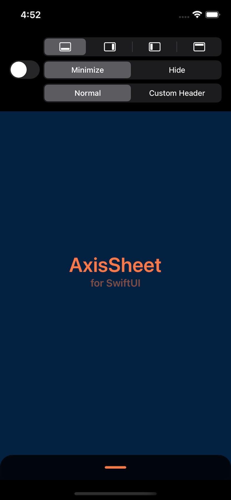
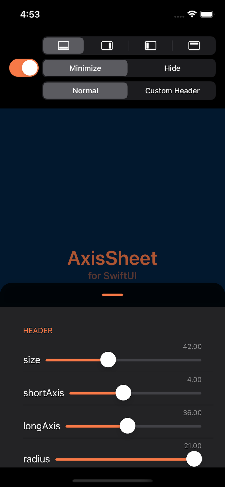
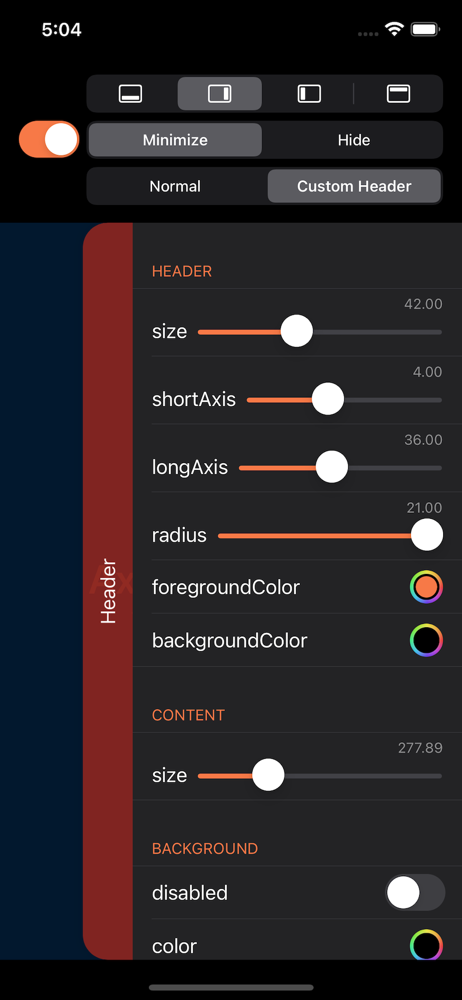

# **AxisSheet for SwiftUI**
It is a library that handles the sheet view in 4 directions (.top, .bottom, .leading, .trailing) according to the axis type. It supports iOS and macOS.

[](https://developer.apple.com/macOS)
[](https://developer.apple.com/iOS)
[](https://developer.apple.com/macOS)
[](https://www.instagram.com/dev.fabula)
[](https://developer.apple.com/documentation/swift_packages/package/)
[](https://opensource.org/licenses/MIT)  

## Screenshot
|Example|Bottom|Trailing|
|:---:|:---:|:---:|
||||

https://user-images.githubusercontent.com/1617304/154444398-f0ff79c1-f482-4d56-8e0d-93587b49db4c.mp4

## Example
[https://fabulaapp.page.link/228](https://fabulaapp.page.link/228)

## Usages
1. How to use the default header views.
    ```swift
    AxisSheet(isPresented: $isPresented, constants: constants) {
         Text("Content View")
    }
    
    /// or
    
    Text("Content View")
         .axisSheet(isPresented: $isPresented, constants: constants)
    ```
2. How to use custom header views.
    ```swift
    AxisSheet(isPresented: $isPresented, constants: constants, header: {
        Rectangle().fill(Color.red.opacity(0.5))
            .overlay(Text("Header"))
    }, content: {
        Text("Content View")
    })
    
    /// or
    
    Text("Content View")
        .axisSheet(isPresented: $isPresented, constants: constants) {
            Rectangle().fill(Color.red.opacity(0.5))
                .overlay(Text("Header"))
        }
    ```
## Swift Package Manager
The Swift Package Manager is a tool for automating the distribution of Swift code and is integrated into the swift compiler. Once you have your Swift package set up, adding AxisSheet as a dependency is as easy as adding it to the dependencies value of your Package.swift.

```swift
dependencies: [
    .package(url: "https://github.com/jasudev/AxisSheet.git", .branch("main"))
]
```

## Contact
instagram : [@dev.fabula](https://www.instagram.com/dev.fabula)  
email : [dev.fabula@gmail.com](mailto:dev.fabula@gmail.com)

## License
AxisSheet is available under the MIT license. See the [LICENSE](LICENSE) file for more info.
